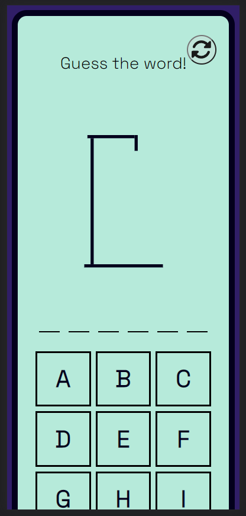
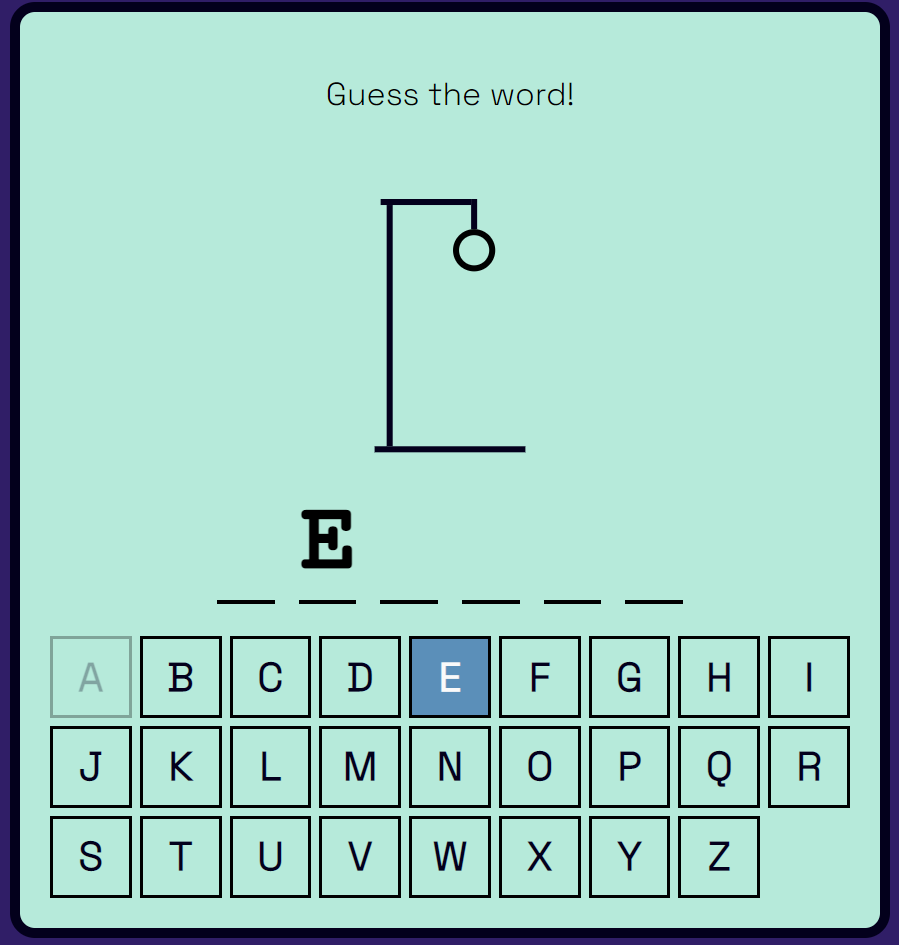

# Hangman

## Objective
To demonstrate things learned from SUTD Module: Fundamentals in Frontend Development by developing a reactive site with React and deployment pipeline.


# Find the website here: [Hangman](https://austin-jrh.github.io/hangman/)

- [Hangman](#hangman)
    - [Objective](#objective)
    - [How to Play](#how-to-play)
    - [Tech used](#tech-used)
    - [CI/CD](#cicd)
    - [Tests](#tests)
    - [Best-practice efforts](#best-practice-efforts)
    - [Learnings](#learnings)

## How to Play

### Description
```
A random word will be given, Player will have to guess the word by inputting letters.
```


### Guess a Letter

``` 
Player can `TAP` on any `LETTER` (for computers: or `KEY` the letter using `KEYBOARD`) 
to attempt to guess if the Letter is included in the Word. 
```


### Letter is not in Word

```
If the Letter is not in the Word, a part of the Hangman will be drawn. An attempt is counted.
```


### Letter is in Word

```
If the Letter is in the Word, the Letter will appear.
```


### How to Lose

```
Player runs out of attempts when the whole Hangman is drawn!
```


### How to Win

```
Player fully guesses the Word!
```


### Get a new Word

```
Click the Restart Button to get a new Word.
```


## Tech used
- ReactJS
- Vite
- Typescript
- ESLint
- Jest
- Github Actions
- Github Pages
- random-words (https://www.npmjs.com/package/random-words?activeTab=readme)
- FontAwesome icons (https://fontawesome.com/docs/web/setup/packages)
- Google fonts (https://fonts.google.com/)

Hangman icon from icons8.com (https://icons8.com/icons/set/hangman)

## CI/CD
The project uses Github Actions to perform CI/CD operations:

1. Checkout Repository
1. Install NodeJS
1. Install Dependencies
1. Build Project
1. Run ESLint
1. Run Jest Tests (UI, Unit, Integration tests)
1. Send to deploy using github-pages

## Tests
### `<App />` tests

- Check whether all components are present (`Hangman Drawing`, `Hangman Word`, `Keyboard`, `Reset Game Button`)
- Check that restart game works
- Check that pressing a key will either appear in the word or draw the head of a hangman

### `<HangmanDrawing />` tests

- Hangman stand is visible
- Hangman body part is visible depending on the number of guesses

### `<HangmanWord />` tests

- Revealed letters is visible
- Displayed letters matches the word to guess

### `<Keyboard />` tests

- All 26 keys are present and interactable
- Unable to click disabled keys

## Best-practice efforts

1. Using TypeScript

    - Easier to read code and avoid errors, removes uncertainty

1. Use of linter and code formatter

    - More readable code and detect mistakes early

1. Adding tests

    - Detect bugs and inconsistencies

1. Use of React Hooks

    - Using `useEffect` and `useCallback`

    ```js
    const addGuessedLetter = useCallback(
      (letter: string) => {
        if (guessedLetters.includes(letter) || isLoser || isWinner) return;

        setGuessedLetters((currentLetters) => [...currentLetters, letter]);
      },
      [guessedLetters, isWinner, isLoser]
    );

    useEffect(() => {
      const handler = (e: KeyboardEvent) => {
        const key = e.key;

        if (!key.match(/^[a-z]$/)) return;

        e.preventDefault();
        addGuessedLetter(key);
      };

      document.addEventListener("keypress", handler);

      return () => {
        document.removeEventListener("keypress", handler);
      };
    }, [addGuessedLetter]);
    ```

1. Don't use too many unnecessary states

    ```js
    const incorrectLetters = guessedLetters.filter(
      (letter) => !wordToGuess.includes(letter)
    );

    const isLoser = incorrectLetters.length >= 6; // 6 body parts
    const isWinner = wordToGuess
      .split("")
      .every((letter) => guessedLetters.includes(letter));
    ```
    
## Learnings

1. Overall how to use `ReactJS` (`React Hooks`, `TypeScript`).
1. How to use `Jest` for testing.
1. How to deploy using `Github Pages`.
1. How to make simple CI/CD pipeline using `Github Actions`.
